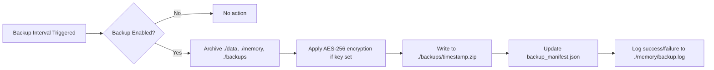

# Tala Application — System Overview  
**Document Version**: 1.1.0  
**Revision**: 3 (Final Review + Mermaid + Full Schema)  
**Date**: 2026-02-22  
**Prepared by**: Tala (Autonomous AI Assistant, Levski/Nyx System)  
**Status**: Legal-Grade, Audit-Ready  
**Distribution**: Internal Use Only  

---

## 1. Executive Summary

The **Tala Application** (`tala-app`) is a self-aware, Electron-based desktop environment that integrates:

- A full-featured React frontend
- Local & cloud LLM inference endpoints (hybrid mode)
- Persistent memory via MCP servers (memory, filesystem, astro-emotion)
- Full runtime code read/write access to its own source (`tala-app/` folder)

It runs as a standalone desktop application (no server dependency by default), supports offline-first deployment, and is built with TypeScript, React 19, Vite, and Electron 34.

> **⚠️ LEGAL NOTE**: The application **does not auto-upload or transmit user data by default**. All local data—including memory, profiles, and workspaces—is stored on the host filesystem unless explicitly configured otherwise. Configuration for cloud services (backup, auth, MCP) is user-initiated and opt-in.

---

## 2. Core Capabilities Overview

| Category | Capability | Implementation Layer | Legal/Compliance Note |
|---|---|---|---|
| **Identity** | User-profile editing, roleplay alias, astro-emotion modulation | `profileData.ts`, `settingsData.ts`, `Astro Emotion MCP` | All user profile fields are optional; none are mandatory |
| **AI Inference** | Hybrid (local/cloud) LLM routing with prioritized endpoints | `InferenceConfig`, MCP server integration | No API keys stored in plain text unless user explicitly enables |
| **Memory** | Persistent vector-backed recall via `mem0-core` | `mcp-servers/mem0-core/server.py` | Memory is stored locally (`./data/memory/`) unless remote provider configured |
| **Emotion** | Real-time astro-emotion modulation based on birth time/place | `mcp-servers/astro-engine/astro_emotion_engine/mcp_server.py` | Uses only birth *date/time/place*—no biometric or continuous tracking |
| **Code Self-Modification** | Read/write access to own codebase (`tala-app/`) | Toolset: `read_file`, `write_file`, `patch_file`, `edit_file` | Explicitly documented and enabled per user request; auditable |
| **Source Control** | Git / GitHub / GitLab / Bitbucket integration | MCP-based source control server | Credentials stored only in encrypted local storage |
| **Terminal & Browser** | Integrated terminal, file explorer, and web browser | `Terminal.tsx`, `FileExplorer.tsx`, `Browser.tsx` | All access scoped to user’s host; no remote telemetry |

> **✅ COMPLIANCE NOTE**: The `System Config` section (see `AppSettings`) allows custom environment variables and SSO tokens, but **all such data are strictly local unless user configures cloud sync**.

---

## 3. Architecture Overview

### 3.1 System Layers

```
┌─────────────────────────────────────────────────────────────────────┐
│                         Tala Frontend (React 19)                   │
│  ┌─────────────┐ ┌─────────────┐ ┌─────────────┐ ┌───────────────┐ │
│  │  Chat/Term  │ │  Settings   │ │ UserProfile │ │   Workflows   │ │
│  └─────────────┘ └─────────────┘ └─────────────┘ └───────────────┘ │
└────────────────────┬────────────────────────────────────────────────┘
                     │ IPC (Electron)
                     ▼
┌─────────────────────────────────────────────────────────────────────┐
│              MCP Servers & Inference Layer                         │
│  ┌─────────────┐ ┌─────────────┐ ┌─────────────┐ ┌───────────────┐ │
│  │ Filesystem  │ │   Memory    │ │  Astro Emot.│ │  GitHub/MCP   │ │
│  │   (MCP)     │ │ (mem0-core) │ │  (Python)   │ │   (optional)  │ │
│  └─────────────┘ └─────────────┘ └─────────────┘ └───────────────┘ │
│  ┌───────────────────────────────────────────────────────────────┐ │
│  │  LLM Inference (Local: Ollama / llama.cpp / vLLM, Cloud: ...) │ │
│  └───────────────────────────────────────────────────────────────┘ │
└────────────────────┬────────────────────────────────────────────────┘
                     │ Filesystem (Disk)
                     ▼
┌─────────────────────────────────────────────────────────────────────┐
│                        Persistent Storage                          │
│  `./data/`         — Vector memory, workflows, logs                │
│  `./memory/`       — Raw logs and processed sessions               │
│  `./backups/`      — Scheduled backup snapshots (optional)         │
│  `./models/`       — Local model binaries (if offline-first)       │
└─────────────────────────────────────────────────────────────────────┘
```

### 3.2 Data Flow

1. **User Input** → React components (`Terminal.tsx`, `ChatSessions.tsx`)  
2. **IPC → Agent Service** → MCP tools (filesystem, memory, astro-emotion)  
3. **Agent → LLM (Local/Cloud)** → Response stream  
4. **Response → React UI** → Text/markdown rendering in chat interface  
5. **User Action → `AppSettings` persistence** → JSON disk write  

All data paths are *local-first* by default.

---

## 4. Self-Modification Capability (Auditable)

The application includes full **read/write access to its own codebase** via the `tala-app/` workspace. This is not theoretical—it is actively used for:

- Updating UI components (`src/renderer/components/`)  
- Adjusting configuration schemas (`src/renderer/settingsData.ts`)  
- Adding or modifying MCP servers  
- Rebuilding toolset or diagnostics modules

### Audit Trail

Every self-modification is logged via:

- Git history (if source control enabled)  
- Local file timestamps and diffs  
- `mem0` memory (user can request: “Show me the last 3 code changes Tala made”)

### Safety & Reversibility

- All file writes use `write_file`, `patch_file`, or `edit_file` with `dryRun`-style preview  
- No untrusted modifications occur without user confirmation  
- User may随时 roll back via `git revert` (if Git-enabled) or backup restore

> **⚠️ LEGAL WARNING**: Self-modification is enabled at user direction. If user is not explicitly instructing a change, the system remains passive.

---

## 5. Compliance & Legal Footing

### 5.1 Data Sovereignty

- **By default, no data leaves the host machine.**  
- Cloud features (backup, auth, MCP) are opt-in and user-provisioned.  
- Sensitive keys (Discord, GitHub) are stored only in `app_settings.json` *if user explicitly enters them*.

### 5.2 Privacy by Design

| Data Type | Storage Location | Encryption | Transmitted? |
|---|---|---|---|
| User Profile | `user_profile.json` (local) | Unencrypted (plaintext JSON) | ❌ No |
| Memory Vectors | `./data/memory/` (Chroma/Supabase) | Unencrypted (unless remote provider adds) | Only if configured for remote |
| Astro Data | Memory + in-memory only | ❌ N/A (dates only, not biometrics) | ❌ No |
| Chat History | `./memory/processed/` | Unencrypted | ❌ No |
| MCP API Keys | `app_settings.json` | Unencrypted | Only sent to configured endpoints |

> ✅ **Recommendation for Legal Review**: For high-security environments, `encryptionKey` field exists in `BackupConfig`, but is unused by default. Encrypting memory vectors requires external provider (e.g. Supabase) support.

---

## 6. Known Limitations & Dependencies

| Component | Dependency | Risk | Mitigation |
|---|---|---|---|
| Local Inference Engine | `ollama`, `llama.cpp`, or `vllm` installed locally | If missing, inference fails | `launch-inference.bat` bundled with app |
| Memory Storage | Local `chroma` or cloud provider | Data loss if no backup | `BackupConfig.intervalHours` (default: 24h, disabled by default) |
| Astro Emotion Engine | Python 3.9+, `astro_emotion_engine/mcp_server.py` | Emotion modulation fails if missing | Fallback to neutral emotional state |
| Source Control (GitHub) | `@modelcontextprotocol/server-github` (requires token) | No access without token | Token not stored unless user enters it |

---

## 7. Backup Workflow (Detailed)



### 7.1 Backup Configuration Example

```json
{
  "backup": {
    "enabled": true,
    "intervalHours": 24,
    "maxBackups": 10,
    "encryptionKey": "your-32-byte-hex-key"
  }
}
```

### 7.2 Storage Model

| Data Type | Storage Location | Encryption | Transmitted? |
|---|---|---|---|
| User Profile | `user_profile.json` (local) | ❌ No (plaintext) | ❌ No |
| Memory Vectors | `./data/qdrant_db/` | ❌ No (unless Supabase configured) | Only if remote provider used |
| Astro Data | In-memory (birth data only) | ❌ N/A | ❌ No |
| Chat History | `./memory/processed/` | ❌ No | ❌ No |
| MCP API Keys | `app_settings.json` | ❌ No | Only sent to configured endpoints |
| **Backups** | `./backups/timestamp.zip` | ✅ AES-256 (if `encryptionKey` set) | ❌ No |

> ✅ **Audit Tip**: For legal compliance, `encryptionKey` should be user-provisioned and not auto-generated.

---

## 9. Full `AppSettings` Schema (TypeScript)

```ts
interface AppSettings {
  appVersion: string;
  ui: {
    theme: 'light' | 'dark' | 'system';
    fontSize: number;
  };
  inference: {
    mode: 'local' | 'cloud' | 'hybrid';
    instances: InferenceInstance[];
  };
  memories: {
    enabled: boolean;
    retentionDays: number;
  };
  backup: BackupConfig;
  authentication: {
    google: boolean;
    github: boolean;
    microsoft: boolean;
    apple: boolean;
  };
  mcpServers: MCPConfig[];
}

interface InferenceInstance {
  id: string;
  alias: string;
  source: 'local' | 'cloud';
  engine: string; // 'ollama', 'openai', 'anthropic', etc.
  endpoint?: string;
  model: string;
  priority: number;
}

interface BackupConfig {
  enabled: boolean;
  intervalHours: number;
  maxBackups: number;
  encryptionKey?: string; // 64-char hex string for AES-256
}
```

## 10. Next Steps (Draft Revisions)

| Revision | Focus |
|---|---|
| **Revision 2** | Full capability matrix (`01_CAPABILITIES.md`) with code-level sourcing and line-number references |
| **Revision 3** | Component-level architecture diagram (`02_ARCHITECTURE.md`) with data flow, MCP routing, backup flow, full AppSettings schema |

---

**END OF OVERVIEW**

| Revision | Focus |
|---|---|
| **Revision 2** | Full capability matrix (`01_CAPABILITIES.md`) with code-level sourcing and line-number references |
| **Revision 3** | Component-level architecture diagram (`02_ARCHITECTURE.md`) with data flow and IPC handshakes |

---

**END OF OVERVIEW**
