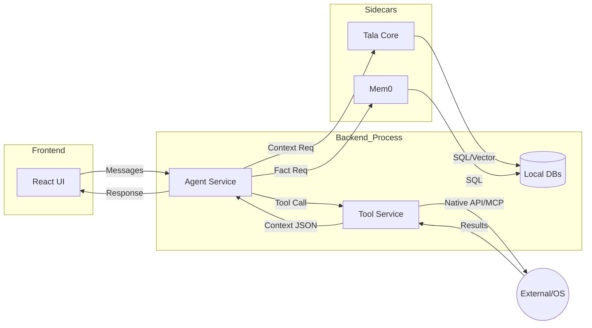

# Data Flow

This document tracks the movement and lifecycle of data within the Tala ecosystem.

## 1. Primary Data Streams

### Chat & Messaging
- **Source**: User Input (UI)
- **Pathway**: `React UI` -> `IPC Bridge` -> `Agent Service` -> `Ollama/Cloud API`
- **Format**: JSON-wrapped text payloads.

### Prompt Context (Augmentation)
- **Source**: MCP Servers (Tala-Core, Mem0)
- **Pathway**: `MCP Sidecars` -> `Agent Service`
- **Data**: Semantic chunks, user facts, system persona instructions.

### Tool Results
- **Source**: Operating System / MCP Servers
- **Pathway**: `OS/Sidecar` -> `Tool Service` -> `Agent Service`
- **Data**: Terminal output, file contents, API returns.

### Telemetry & Logs
- **Source**: All services
- **Pathway**: `IpcRouter` -> `LoggingService` -> `logs/`
- **Persistence**: Flat files (e.g., `agent_trace.log`).

## 2. Persistent Storage

Tala uses several distinct storage mechanisms to balance speed, structure, and searchability.

| Data Type | Storage Mechanism | Location | Purpose |
| :--- | :--- | :--- | :--- |
| **Agent Personas** | JSON File | `data/agent_profiles.json` | Core personality and prompt templates. |
| **User Settings** | JSON File | `data/user_profile.json` | Preferences and API keys. |
| **Semantic Memory** | Vector DB (Chroma/SQLite) | `memory/vector_store/` | High-dimensional embeddings for RAG. |
| **Relational Memory** | SQLite Graph | `memory/graph.db` | Entity relationships and discovery. |
| **Raw Interactions** | SQLite | `memory/history.db` | Full conversation history for continuity. |

## 3. Data Flow Diagram

## 4. Privacy & Security
- **Local Sovereignty**: By default, data flow remains within the local machine.
- **IPC Filtering**: The `Preload` script enforces a strict allow-list of channels, preventing the renderer from accessing raw filesystem APIs directly.
- **Data At Rest**: Configurations containing sensitive keys should be encrypted (Future Decision).
