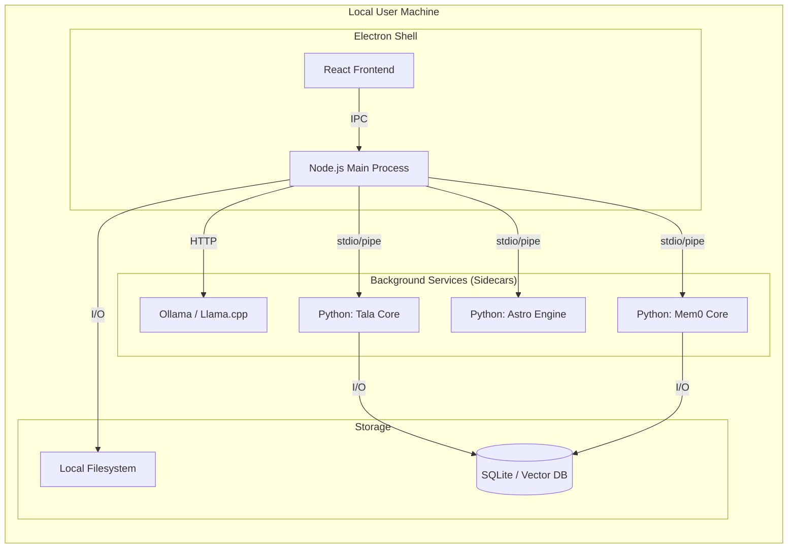

# Deployment Topology

This document describes how the Tala system is distributed and deployed across different runtime environments.

## 1. Local Workstation Deployment (Default)
The primary deployment model for Tala is as a standalone desktop application.

- **Host Environment**: Windows/macOS/Linux.
- **Frontend**: React application running in an Electron Renderer Process (Chromium).
- **Backend**: Electron Main Process (Node.js).
- **Sidecars**:
    - **Python MCP Servers**: Launched as child processes by the Electron Main Process. Each sidecar manages its own virtual environment or system Python context.
    - **Inference Engine**: Local Ollama service or `llama-cpp-python` background server.
- **Communication Path**:
    - `Renderer <-> Main`: IPC (Inter-Process Communication).
    - `Main <-> MCP Servers`: stdio/JSON-RPC (Model Context Protocol).
    - `Main <-> Ollama`: HTTP/REST.

## 2. Portable / Offline Build
Tala can be packaged into a portable distribution that requires minimal system installation.

- **Packaging Tool**: `electron-builder`.
- **Inference Strategy**: Bundled `llama-cpp` binaries or dependency on a pre-installed Ollama instance.
- **Data Persistence**: All databases (SQLite) and configuration files are stored in common application data folders (e.g., `%APPDATA%/tala-app` on Windows).

## 3. Infrastructure Topology Diagram

## 4. Resource Allocation
- **CPU**: Primary usage by LLM inference (local mode) and Python vector calculations.
- **Memory**: Electron host (~200MB-500MB) + Sidecar overhead (~50MB per MCP) + LLM VRAM (varies by model size, e.g., 4GB-8GB for 7B models).
- **Disk**: ~100MB for application code; 4GB+ for model weights.
