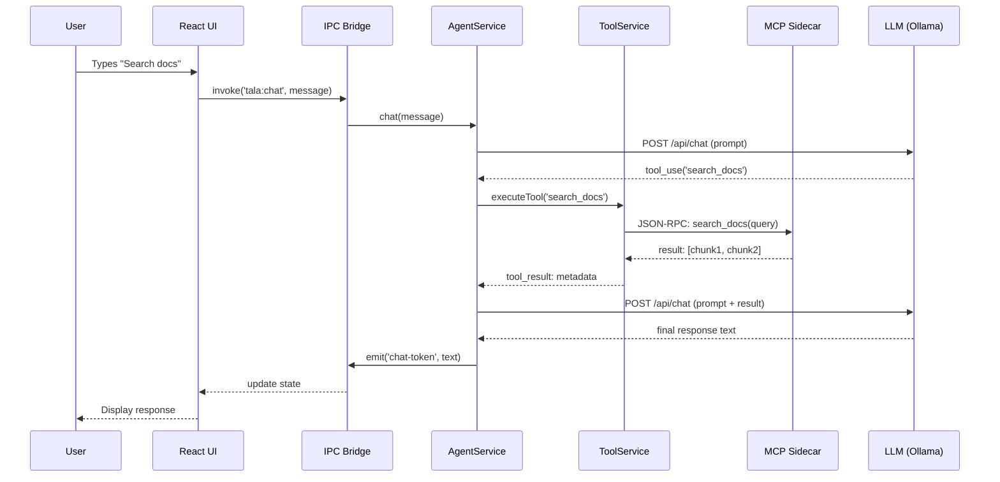

# Service Interactions

This document details the communication protocols and interface boundaries between internal Tala services.

## 1. IPC Bridge (Renderer <-> Main)
The most sensitive interaction boundary. Tala uses a two-stage IPC strategy for security.

- **Preload Script**: `electron/preload.ts` defines a whitelist of safe IPC channels. It uses `contextBridge.exposeInMainWorld` to prevent the renderer from accessing Node.js primitives directly.
- **IPC Router**: `electron/services/IpcRouter.ts` handles the backend reception of messages. It validates the payload and dispatches to the appropriate service (`AgentService`, `ToolService`).
- **Protocol**: Asynchronous request-response and event streaming (for LLM output tokens).

## 2. Agent -> Tool Dispatch
- **Interface**: `ToolService.executeTool(toolName, args)`
- **Mechanism**:
    1. `AgentService` identifies a needed capability.
    2. It calls `ToolService`.
    3. `ToolService` checks its `mcpClients` registry.
    4. If it's an MCP tool, it forwards the request to the target sidecar process.
- **Benefit**: Decouples the reasoning logic from the underlying technical implementation of a tool.

## 3. Model Context Protocol (MCP) Interactions
The standard for all extended capability services.

- **Transport**: Standard JSON-RPC 2.0 over `stdin` and `stdout`.
- **Lifecycle Management**:
    - **Launch**: `ToolService` starts the Python/Node process.
    - **Handshake**: Client and Server exchange capability lists.
    - **Execution**: `AgentService` sends "call tool" requests; Server returns "result".
- **Isolation**: Each MCP server runs in its own process, ensuring that a crash in one sidecar doesn't take down the entire application.

## 4. Brain Interface (Agent -> LLM)
- **Interface**: `IBrain`
- **Implementations**:
    - `OllamaBrain`: Communicates via HTTP to `localhost:11434`.
    - `CloudBrain`: Communicates via HTTPS to external provider endpoints.
- **Logic**: Converts standard Tala internal message structures into the format required by the target LLM API (e.g., OpenAI or Anthropic format).

## 5. Interaction Call Chain

