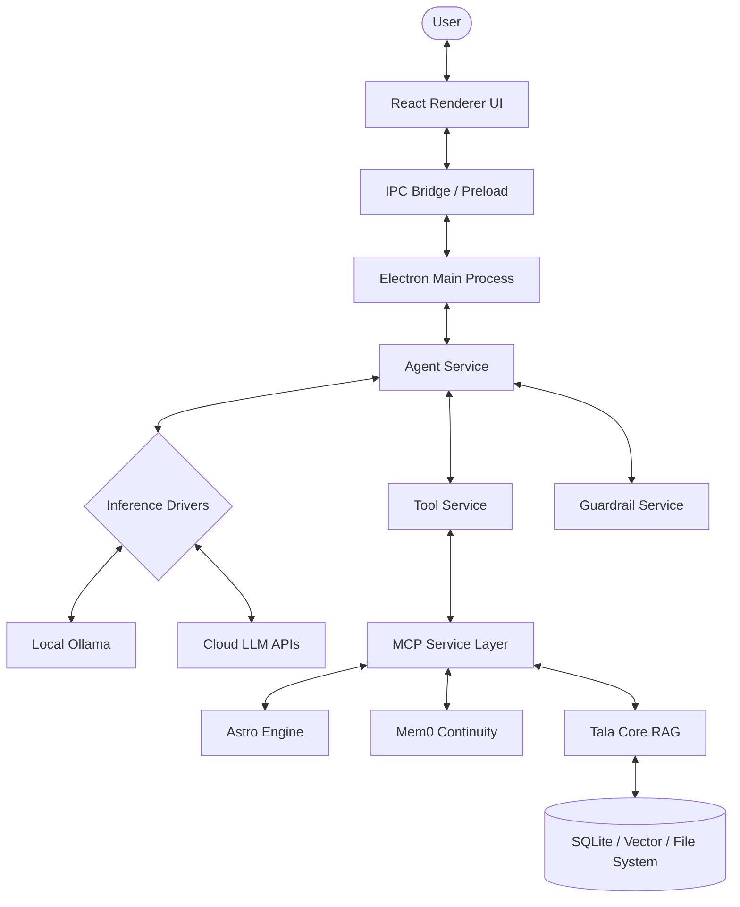

# Tala System Overview

## 1. System Purpose
Tala is a "government-grade" autonomous agent platform designed for secure, local-first artificial intelligence interactions. It provides a robust, multi-process environment where LLMs can interact with tools, memory systems, and external services via a structured protocol (MCP).

## 2. Key Operational Capabilities
- **Autonomous Reasoning**: Multi-turn loops for goal decomposition and execution.
- **Local-First Inference**: Support for local LLM execution via Ollama and llama-cpp-python, ensuring privacy and offline capability.
- **Hybrid Brain Architecture**: Flexible switching between local and cloud inference engines.
- **Extensible Tooling**: Built on the Model Context Protocol (MCP), allowing for modular integration of specialized services.
- **Long-Term Memory**: Multi-layered memory system including semantic retrieval (RAG), graph-based relationship mapping, and fact storage (Mem0).

## 3. Major Subsystems
- **The Shell (Electron Main)**: Orchestrates application lifecycle, native security, and service management.
- **The Interface (React Renderer)**: Provides a dynamic, high-fidelity chat and monitoring interface.
- **The Brain (Agent Service)**: Central reasoning engine that coordinates LLM calls, tool usage, and memory.
- **MCP Service Layer**: A collection of isolated processes providing specialized capabilities like astrological emotional state calculation and persistent memory.

## 4. User Interaction Model
Users interact with Tala through a conversational React-based UI. The system supports direct chat, complex workflow editing, and real-time monitoring of agent reasoning and terminal activity.

## 5. Functional Architecture Walkthrough

## 6. External Dependencies
- **Ollama**: Required for local inference execution.
- **Node.js**: Underlying runtime for the desktop shell.
- **Python 3.10+**: Runtime for MCP services and vector libraries.
- **SQLite**: Primary persistent storage for structured memory.

## 7. World Model Layer (Phase 4A)

Phase 4A adds a structured world model that gives Tala a canonical view of her operating environment before inference. The `WorldModelAssembler` (in `electron/services/world/`) produces a `TalaWorldModel` from:

- `WorkspaceStateBuilder` — workspace root, directories, classification.
- `RepoStateBuilder` — git branch, dirty/clean, project type.
- `RuntimeWorldStateProjector` — projects `RuntimeDiagnosticsSnapshot` into cognition-friendly state.
- `UserGoalStateBuilder` — immediate task, project focus, stable direction.

The world model is integrated into `PreInferenceContextOrchestrator` as a selective context source (contributed only when the turn intent is technical/coding/task/workspace/repo). The full model is never dumped into prompts — only a compact summary.

IPC: `diagnostics:getWorldModel` returns `WorldModelDiagnosticsSummary` (read-only, renderer-safe).

See [`docs/architecture/phase4a_world_model.md`](./phase4a_world_model.md) for full details.

## 8. Self-Maintenance Layer (Phase 4B)

Phase 4B adds a bounded self-maintenance foundation that lets Tala detect unhealthy operational state and take safe, policy-driven recovery actions.

The self-maintenance layer sits on top of the World Model and Runtime Diagnostics systems. Key components:

- **`MaintenanceIssueDetector`** — detects issues from `RuntimeDiagnosticsSnapshot` and `TalaWorldModel` (provider health, MCP flapping, world model degradation)
- **`MaintenancePolicyEngine`** — single canonical policy engine that classifies each issue into: `monitor`, `recommend_action`, `request_user_approval`, `auto_execute`, or `suppress_temporarily`
- **`MaintenanceActionExecutor`** — wraps `RuntimeControlService` with safety gates, structured result objects, and telemetry
- **`MaintenanceLoopService`** — bounded maintenance state manager; supports `observation_only`, `recommend_only`, and `safe_auto_recovery` modes

Maintenance state is exposed via:
- `diagnostics:getMaintenanceState` — IPC read model
- `diagnostics:runMaintenanceCheck` — trigger manual cycle
- `diagnostics:setMaintenanceMode` — change operational mode
- `PreInferenceContextOrchestrator` — compact maintenance summary injected selectively on troubleshooting/technical turns

See [`docs/architecture/phase4b_self_maintenance_foundation.md`](./phase4b_self_maintenance_foundation.md) for full details.

## 9. A2UI Workspace Surfaces (Phase 4C)

Phase 4C adds dynamic structured UI surfaces that open in the document/editor pane. These surfaces let the user inspect Tala's current cognitive, world-model, and maintenance state in a readable, actionable form without polluting the chat window.

**Core rule:** A2UI surfaces render in the document/editor pane only. Chat receives lightweight notices only (e.g. "I opened the cognition surface in the workspace.").

Key components:

- **`A2UIWorkspaceRouter`** (`electron/services/A2UIWorkspaceRouter.ts`) — assembles surface payloads from diagnostics/read models and pushes them to the renderer via `agent-event: a2ui-surface-open`. Maintains an open-surface registry.
- **`A2UIActionBridge`** (`electron/services/A2UIActionBridge.ts`) — validates and executes renderer-dispatched actions against a strict allowlist. Routes to runtime services.
- **Surface mappers** — typed, bounded converters from diagnostics data to A2UI component trees:
  - `CognitionSurfaceMapper` — maps `CognitiveDiagnosticsSnapshot` → A2UI
  - `WorldSurfaceMapper` — maps `TalaWorldModel` → A2UI
  - `MaintenanceSurfaceMapper` — maps `MaintenanceDiagnosticsSummary` → A2UI
- **`A2UIWorkspaceSurface`** (`src/renderer/A2UIWorkspaceSurface.tsx`) — React renderer host for the document/editor pane. Uses the existing `BasicComponents` catalog.

Named surfaces with stable tab IDs:

| Surface | Tab ID | Shows |
|---|---|---|
| `cognition` | `a2ui:cognition` | Mode, memory, docs, emotional modulation, reflection notes |
| `world` | `a2ui:world` | Workspace, repo, runtime/MCP, user goal |
| `maintenance` | `a2ui:maintenance` | Issues, severity, actions, cooldown state |

IPC surface:
- `a2ui:openSurface(id)` — open/refresh a named surface
- `a2ui:dispatchAction(action)` — allowlisted action dispatch
- `a2ui:getCognitiveSnapshot()` — current cognitive diagnostics
- `a2ui:getDiagnostics()` — surface/action diagnostics summary

Telemetry events: `a2ui_surface_open_requested`, `a2ui_surface_opened`, `a2ui_surface_updated`, `a2ui_surface_failed`, `a2ui_action_received`, `a2ui_action_validated`, `a2ui_action_executed`, `a2ui_action_failed`.

See [`docs/architecture/phase4c_a2ui_workspace_surfaces.md`](./phase4c_a2ui_workspace_surfaces.md) for full details.

## 10. Shared Runtime Execution Contracts

`shared/runtime/executionTypes.ts` provides the canonical vocabulary for describing, routing, and tracking runtime execution units across the system.

All types are pure TypeScript — no logic, no imports, no runtime cost. They are intended as a stable cross-subsystem foundation that later phases will adopt incrementally.

**Exported types:**

| Type | Role |
|---|---|
| `RuntimeExecutionType` | Discriminated kind of execution (`chat_turn`, `workflow_run`, `tool_action`, `autonomy_task`, `reflection_task`, `system_maintenance`) |
| `RuntimeExecutionOrigin` | Where the request originated (`chat_ui`, `ipc`, `workflow_builder`, `guardrails_builder`, `autonomy_engine`, `system`, `scheduler`) |
| `RuntimeExecutionMode` | Tala mode at request time (`assistant`, `hybrid`, `rp`, `system`) |
| `RuntimeExecutionStatus` | Normalized lifecycle status (`created` → `accepted` → `blocked` / `planning` → `executing` → `finalizing` → `completed` / `failed` / `cancelled` / `degraded`) |
| `ExecutionRequest` | Normalized request envelope (id, parent, type, origin, mode, actor, input, metadata, createdAt) |
| `ExecutionState` | Mutable tracked runtime state (status, phase, subsystem, retries, toolCalls, timestamps, degraded flag) |

**Relationship to existing contracts:**

- `shared/executionTypes.ts` — Phase 3 controlled-execution lifecycle (patch apply, rollback, verification). Narrower scope; not replaced.
- `electron/services/kernel/AgentKernel.ts` — `KernelExecutionMeta` / kernel-local `ExecutionType`. Phase 2 adoption candidate.
- `shared/autonomyTypes.ts` — autonomous goal tracking. Phase 2 adoption candidate via `ExecutionState`.

**Phase 2 adoption candidates (first callers):**
- `AgentKernel.ts` — `KernelExecutionMeta.executionType` can reference `RuntimeExecutionType`
- `IpcRouter.ts` — `chat-done` payload can surface `executionOrigin`
- `AutonomousRunOrchestrator.ts` — autonomous runs map to `ExecutionState`
