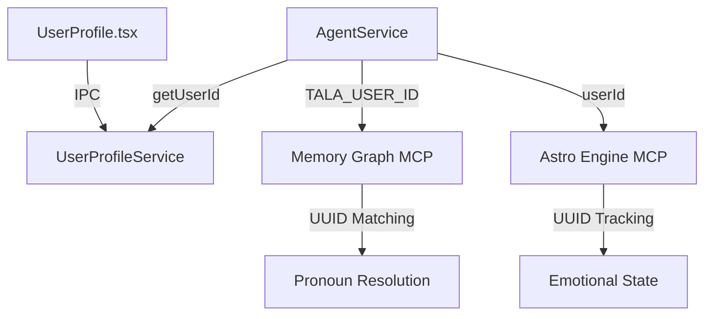

# Identity Handling: UUID-Only Canonical Architecture

This document describes the hardened identity handling system in Tala, which enforces a single source of truth and a strictly UUID-based canonical identity for all user entities.

## Core Principles

1.  **Single Source of Truth**: User identity (Name, DOB, etc.) is sourced exclusively from the **User Profile page** (`UserProfile.tsx`) and persisted in `data/user-profile.json`.
2.  **Strict Anonymity**: Explicit identity strings (e.g., "Steven Pollard") are strictly forbidden in code, prompts, and default test data.
3.  **UUID Canonical Identity**: All user entities across all systems (Memory Graph, Astro Engine, Agent Service) are indexed by a stable **UUID** (`userId`).
4.  **PII Isolation**: Sensitive PII (like DOB) is redacted from all logs and debug outputs. It is passed securely to MCP servers using environment-level UUID identification.
5.  **Data-Driven Resolution**: Memory and pronoun resolution ("my/mine/me/I") are mapped directly to the active user's UUID at runtime.

## Architecture

### 1. UserProfileService
- **UUID Enforcement**: Automatically generates and persists a valid UUID if no profile exists.
- **Sanitized Context**: Extracts a `UserIdentityContext` containing only the UUID and preferred display names for the LLM.

### 2. Memory Graph (tala-memory-graph)
- **UUID Routing**: All `user` nodes are indexed by UUID.
- **Migration Engine**: On startup, the server automatically migrates legacy user nodes (e.g., ID "user" or "anonymous-user") to the canonical UUID.
- **Pronoun Resolution**: The `MemoryRouter` uses the dynamic `userId` to bind personal pronouns to the correct graph entity.

### 3. Astro Engine Integration
- **Profile Identification**: Astro profiles are keyed by the user's UUID, ensuring emotional state tracking is stable across name changes.
- **PII Safety**: The `AgentService` uses a `stripPIIFromDebug` utility to redact PII from all engine-related logs and the `igniteSoul` sequence.

## Security & Verification

### 1. CI Identity Tripwire
A dedicated test (`tests/IdentityTripwire.test.ts`) runs with every build to:
- Scan the source code and prompts for forbidden identity seeds.
- Verify the format and stability of the user's UUID.

### 2. Runtime Integrity Audit
The `scripts/audit_identity_integrity.ts` tool can be run against a live system to:
- Verify that the local profile matches the internal memory graph identity.
- Flag any non-UUID user entities or PII leakage in the database.

## Data Flow

