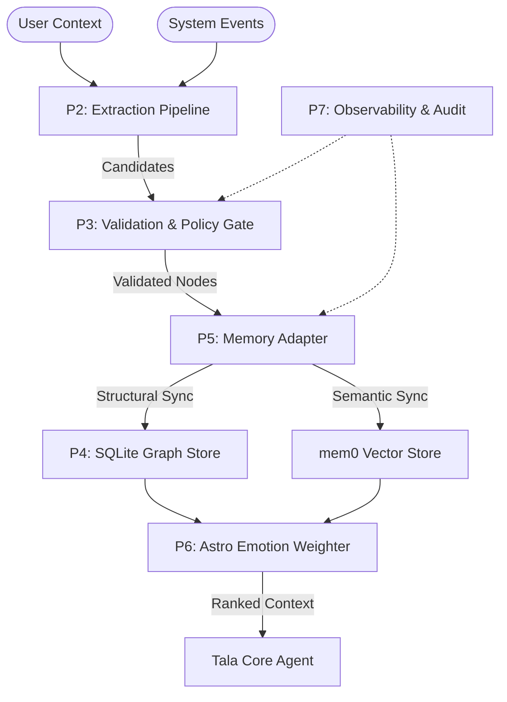

# Tala Structured Memory & Graph System: Architecture Overview

This document summarizes the results of Phases 1-7, providing the blueprint for Tala's long-term cognitive backbone.

## 1. System Architecture

## 2. Core Modules (Implemented)

### Phase 1: Metadata Schema
- **File**: `models/schemas.py`, `node.schema.json`
- **Key Feature**: Deterministic UUIDs, Provenance requirements, and Confidence vectors.

### Phase 2: Extraction Pipeline
- **File**: `extractor.py`, `EXTRACTION_PIPELINE.md`
- **Key Feature**: Atomic fact extraction with mandatory evidence snippets.

### Phase 3: Validation & Policy
- **File**: `validator.py`, `VALIDATION_POLICY.md`
- **Key Feature**: Secret detection, rule-based gating, and multi-vector confidence scoring.

### Phase 4: Graph Storage
- **File**: `graph_store.py`, `GRAPH_LAYER.md`
- **Key Feature**: High-performance SQLite persistence with k-hop neighborhood expansion.

### Phase 5: Integration
- **File**: `adapter.py`, `MEM0_INTEGRATION.md`
- **Key Feature**: Idempotent synchronization between vector and graph layers.

### Phase 6: Emotion Integration
- **File**: `emotion_engine.py`, `ASTRO_CONTEXT.md`
- **Key Feature**: State-driven salience modulation (boosts/suppressions) for retrieval.

### Phase 7: Observability
- **File**: `logger.py`, `OBSERVABILITY.md`
- **Key Feature**: Deterministic audit logs and explainability metrics.

## 3. Production Readiness

The system is designed for **Reliability over Speed**. 
- All code is modular Python 3.10+.
- Pydantic v2 ensures strict type safety.
- SQLite provides transactional integrity.
- Audit logs ensure full traceability of every "memory remembered."
