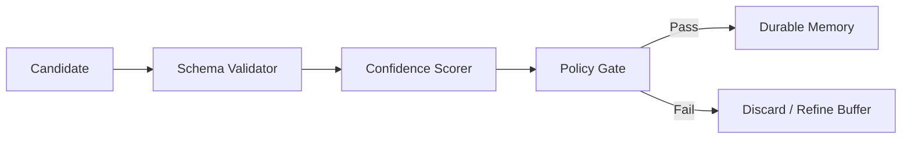

# Phase 3 — Validation and Policy Gate

The Validation Layer is the primary safety filter between **Memory Candidates** (Phase 2) and **Durable Memory** (Phase 4). Its role is to ensure that only high-confidence, safe, and traceable facts are stored.

## 1. Validation Flow



## 2. Confidence Scoring Algorithm

The `overall_confidence` is a weighted average:

- **Evidence Quality (40%)**: Is the evidence a direct quote? Does the sourceID point to a reliable file (e.g., `.ts` vs `.txt`)?
- **Model Certainty (40%)**: The extraction LLM's self-reported confidence.
- **Provenance Reputation (20%)**: Does this source historically produce accurate facts?

**Thresholds**:
- `> 0.8`: Auto-store as Durable.
- `0.4 - 0.7`: Store as "Observation" (weak link).
- `< 0.4`: Reject.

## 3. Privacy & Sensitivity Policies

The gate enforces the following strict rules:

1. **Secret Detection**: Candidates containing detected API keys, passwords, or tokens are IMMEDIATELY discarded.
2. **PII Filtering**: Personal identifiable information (emails, phone numbers) is flagged for `PrivacyLevel.PRIVATE`.
3. **Safety Gate**: Facts that contradict established "Safety Rules" are rejected.

## 4. Implementation (Policy Validator)

```python
class PolicyValidator:
    def validate(self, candidate: MemoryCandidate) -> bool:
        # 1. Secret check
        if self._has_secrets(candidate.content): return False
        
        # 2. Confidence check
        if candidate.confidence < 0.4: return False
        
        # 3. Evidence check
        if not candidate.evidence or len(candidate.evidence) < 5: return False
        
        return True
```
